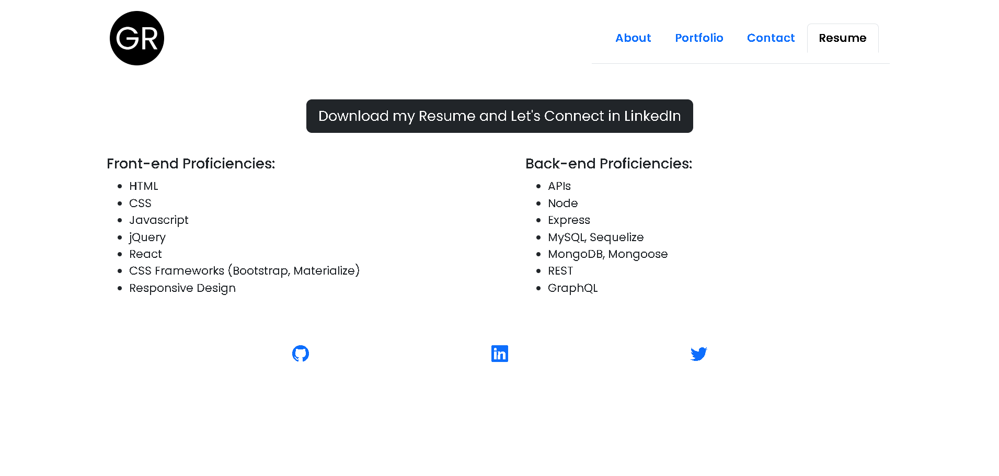

# React Portfolio

## Description

This react portfolio uses shows my knowledge of React and other latest technologies in web development. It also showcases some of the projects I've worked on.

## Table of Contents

* [Technologies Used](#Technologies-Used)    
* [Screenshots](#Screenshots) 
* [Deployed App](#Deployed-App) 
* [License](#License)    
* [Questions](#Questions)

## Technologies Used
    - React
    - HTML5
    - CSS3
    - Node.js
    - Github Pages

## Screeshots

About Section 

Portfolio Section 

Contact Section 

Resume Section 

## Deployed App

Link to the deployed app on Github: [https://garethus.github.io/react-portfolio/#about]

## License

Licensed under the [MIT](./LICENSE) license.

## Questions
    
If you have any questions about the project please contact me through my [GitHub](https://github.com/Garethus) or email me at reyes.grethelmaec@gmail.com.

